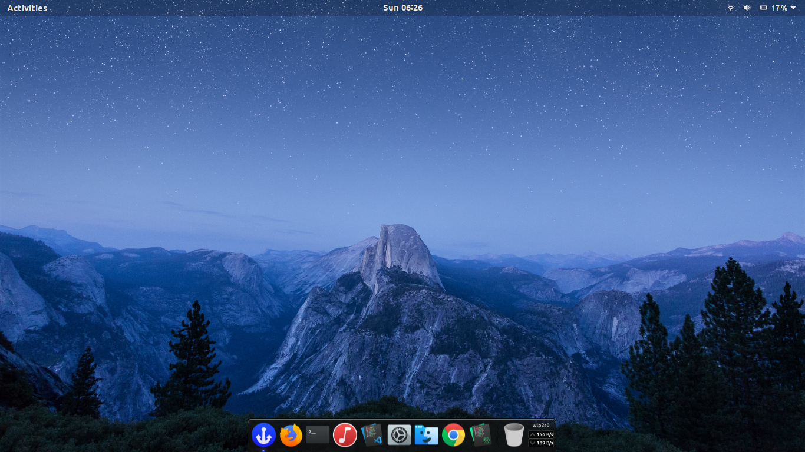

# The Unknown OS {X}
The Unknown OS {X} is a complete Operating System based on Ubuntu that ships the essential apps and services for the daily and work related use. 

We ship with preinstalled libraries right in the box.

## Looks great on the latest devices

The Unknown OS {X} is designed to work beautifully on the latest laptops, desktops and touch screen devices, it looks incredible on high resolution screens — and with touch screen enhancements and interface refinements, it’s now even easier to use.

  

## Close to Upstream

The Unknown OS {X} stays in lockstep with upstream, always staying on the latest version of the kernel and compilers. Daily security mitigations deliver available security updates to customers rapidly. 

